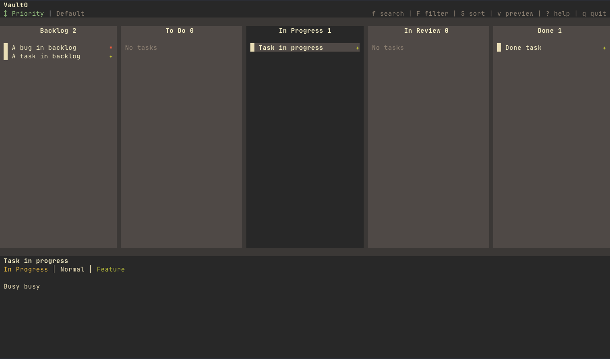

# Vault0 — Terminal Kanban Board

<div align="center">



</div>

A local-first, per-repo terminal UI kanban board with hierarchical tasks, dependency tracking, and SQLite persistence. Designed for developers who live in the terminal.

**Vault0** is named after Fallout lore — Vault 0 is the control center that monitors and controls the entire vault network. This TUI is your control center for task management.

## Features

- **5-Column Kanban Board**: Backlog, To Do, In Progress, In Review, Done
- **Dual Interface**: Interactive TUI and headless CLI (`vault0 task add`, `vault0 task list`, etc.)
- **Dependency Tracking**: Mark tasks as blocked/ready based on upstream dependencies
- **Cycle Detection**: Prevents circular dependencies via DAG reachability checks
- **Hierarchical Tasks**: Create subtasks from the board view (`A`) or detail view
- **Priority & Tags**: Organize with critical/high/normal/low priorities and comma-separated tags (editable in create/edit dialogs, displayed as badge chips in detail view, deduplicated on save)
- **Live Search & Filtering**: Inline text search (`f`), multi-section filter menu (`F`), ready/blocked toggles
- **SQLite Persistence**: Per-repo database at `.vault0/vault0.db` with embedded migrations
- **Keyboard-First**: Vim-inspired navigation, all actions via keyboard
- **Git-Aware Header**: Shows current branch, staged/modified/untracked counts, ahead/behind remote
- **Auto-Refresh**: Watches database file for external changes (e.g., CLI in another terminal)
- **Audit Trail**: Full status history for every task change
- **Terminal-Aware**: Graceful degradation for narrow terminals, resize support
- **Custom Themes**: Bundled Selenized and Solarized theme families with light/dark variants
- **Config File Support**: Global (`~/.config/vault0/config.json`) and per-project (`.vault0/config.json`) configuration with deep merge
- **OpenCode Integration**: CLI supports `opencode` and `opencode-plan` task sources for AI tool integration
- **Releases**: Group completed tasks into named releases, optionally bump version files (package.json, pyproject.toml, Cargo.toml, pom.xml), and browse/restore from a releases archive view
- **Archive Inbox**: Dedicated view (`Z`) for archived and cancelled tasks with bulk restore/delete actions

## Installation

### Quick Install (Recommended)

```bash
curl -fsSL https://raw.githubusercontent.com/douglasf/vault0/main/install.sh | sh
```

This detects your platform, downloads the latest prebuilt binary, and installs to `~/.local/bin`. Override the install directory with `VAULT0_INSTALL_DIR`:

```bash
curl -fsSL https://raw.githubusercontent.com/douglasf/vault0/main/install.sh | VAULT0_INSTALL_DIR=/usr/local/bin sh
```

### Manual Download

Download a prebuilt binary from [GitHub Releases](https://github.com/douglasf/vault0/releases). Available targets:

| Platform | Architecture | Binary |
|----------|-------------|--------|
| macOS | Apple Silicon | `vault0-darwin-arm64` |
| macOS | Intel | `vault0-darwin-x64` |
| Linux | x64 | `vault0-linux-x64` |
| Linux | ARM64 | `vault0-linux-arm64` |
| Windows | x64 | `vault0-windows-x64.exe` |

### Build & Install (Compiled Binary)

```bash
make install              # builds, signs, and installs to ~/.local/bin
vault0                    # launch from any directory
```

Override the install prefix with `make install PREFIX=/usr/local/bin`.

### Install from Source

Requires **Bun** >= 1.0.0.

```bash
git clone https://github.com/douglasf/vault0.git
cd vault0
bun install
bun run src/index.tsx
```

### OpenCode Integration

Vault0 provides an MCP server. Setup is specifically for [OpenCode](https://opencode.ai). One command gets you up and running. The MCP provides 7 tools: `task-view`, `task-add`, `task-move`, `task-update`, `task-complete`, `task-list`, and `task-subtasks`.

#### Quick Start

```bash
vault0 mcp init --write
```

This creates (or updates) an `opencode.json` file in your current directory with the vault0 MCP server entry. If you already have an `opencode.json`, it merges the vault0 config into it.

#### Global Setup

If you want vault0 available across all your OpenCode projects:

```bash
vault0 mcp init --write --path ~/.config/opencode
```

OpenCode will automatically pick up this configuration.

#### Manual Setup

If you prefer to paste the config yourself:

```bash
vault0 mcp init
```

This prints the JSON snippet. Copy and paste it into your `opencode.json` file.

#### Advanced: Custom Tool Permissions

For fine-grained control over which agents can use which vault0 tools, see [`opencode/reference-config.jsonc`](opencode/reference-config.jsonc). Customize the reference config and merge it into your OpenCode config. This is entirely optional — the basic setup above works without it.

## Usage

### TUI (Interactive Board)

```bash
vault0                    # Launch in current directory
vault0 --path DIR         # Launch in specific directory
vault0 --help             # Show help
vault0 --version          # Show version
```

### CLI (Headless Task Management)

```bash
vault0 task add --title "Fix login bug" --priority high --status todo
vault0 task list --status in_progress
vault0 task list --search "login bug"    # FTS5 search across title, description, solution, tags
vault0 task list --tag bug,ui            # Tasks with ANY of these tags (OR match)
vault0 task list --tags-any bug,ui       # Alias for --tag
vault0 task list --tags-all bug,ui       # Tasks with ALL of these tags (AND match)
vault0 task list --format json
vault0 task view abc12345
vault0 task edit abc12345 --priority critical
vault0 task move abc12345 --status done
vault0 task delete abc12345
vault0 task edit abc12345 --dep-add def67890
vault0 task edit abc12345 --dep-list
vault0 board list
vault0 task                               # Show available task commands
vault0 task edit --help                   # Show edit command usage
vault0 update                             # Install the latest version
```

The CLI outputs plain text by default. Pass `--format json` for machine-readable output. Task IDs can be shortened — use the last 8+ characters.

### Version Check & Auto-Update

Vault0 checks for new versions in the background on every TUI launch. Version information is cached for 24 hours to avoid unnecessary network requests.

When a newer version is available, an update notification is displayed on the exit screen after you quit the TUI:

```
Update available: 0.1.0 → 0.2.0
Run `vault0 update` to upgrade
```

Run `vault0 update` to download and install the latest version in-place.

### Keyboard Shortcuts

Press `?` inside the app to see a full list

### Data Storage

All data is stored locally in `.vault0/vault0.db` (per repository):

```
.vault0/
  vault0.db          # SQLite database
  vault0.db-wal      # Write-ahead log (WAL mode)
  vault0.db-shm      # Shared memory file
  .gitignore         # Auto-created — prevents .vault0/* from being committed
```

The `.vault0/` directory is automatically git-ignored on creation and is safe to leave in your repository root. Vault0 automatically detects the Git repository root, so you can run it from any subdirectory and it will always use the same database. If you're not inside a Git repository, it falls back to the current working directory.

## Architecture

### Technology Stack

| Layer | Technology |
|-------|-----------|
| UI Framework | [@opentui/react](https://opentui.dev/) (React 19 for terminal UIs) |
| Database | SQLite via [Drizzle ORM](https://orm.drizzle.team/) |
| Language | TypeScript (strict mode) |
| Runtime | [Bun](https://bun.sh/) (or Node 20+) |
| ID Generation | [ULID](https://github.com/ulid/spec) (time-sortable unique IDs) |


## Development

### Development Commands

```bash
bun install               # Install dependencies
bun run src/index.tsx      # Launch TUI
bun --watch run src/index.tsx  # Auto-reload on file changes

# Or via Make targets
make start                # Launch TUI
make dev                  # Auto-reload on file changes
make typecheck            # Run TypeScript type checker
make build                # Build standalone binary (no install)
make install              # Build, sign, and install to ~/.local/bin
make uninstall            # Remove from ~/.local/bin
make clean                # Remove build artifacts
make release              # Tag and push a new release

# Database management (via Drizzle Kit)
bun run db:generate       # Generate migration from schema changes
bun run db:migrate        # Run pending migrations
bun run db:push           # Push schema directly to database
bun run db:studio         # Open Drizzle Studio (web-based DB browser)
```

### Running Tests

Vault0 uses Bun's built-in test runner with real in-memory SQLite databases (no mocks):

```bash
bun test                              # Run all tests
bun test src/test/queries.test.ts     # Run a single test file
bun test --grep "createTask"          # Run tests matching a pattern
```

Test files are located in `src/test/` and cover queries, DAG operations, CLI commands, CLI parsing, formatting, migrations, transaction safety, and smoke tests.

### TypeScript

The project uses strict TypeScript with Bun types. To type-check:

```bash
bun run typecheck         # or: make typecheck
```

> **Note**: `schema.ts` produces 2 expected warnings due to Drizzle ORM's self-referential table pattern (tasks.parentId references tasks.id). These are harmless.

## Troubleshooting

### "Permission Denied" Error

The app needs write access to the `.vault0/` directory:

```bash
ls -la .vault0/
chmod 755 .vault0    # Fix permissions if needed
```

### "Database Locked" or Corruption

If the database becomes corrupted or stuck:

```bash
mv .vault0/vault0.db .vault0/vault0.db.backup
vault0  # Relaunch — creates a fresh database
```

### Narrow Terminal

If the UI looks broken on small terminals:
- Resize to at least 80x24 (columns x rows)
- Below 80 columns, the app automatically switches to a single-column degraded view

### Error Log

Runtime errors are logged to `.vault0/error.log` for debugging.

## License

MIT

## Acknowledgments

- Built with [@opentui/react](https://opentui.dev/) (React 19 for terminal UIs), [Drizzle ORM](https://orm.drizzle.team/), and SQLite
- Named after [Vault 0](https://fallout.fandom.com/wiki/Vault_0) from the Fallout universe

---

**Version**: 0.2.0 (Beta) — Core functionality complete, releases support, OpenCode MCP integration.
Press `?` in the app for help.
